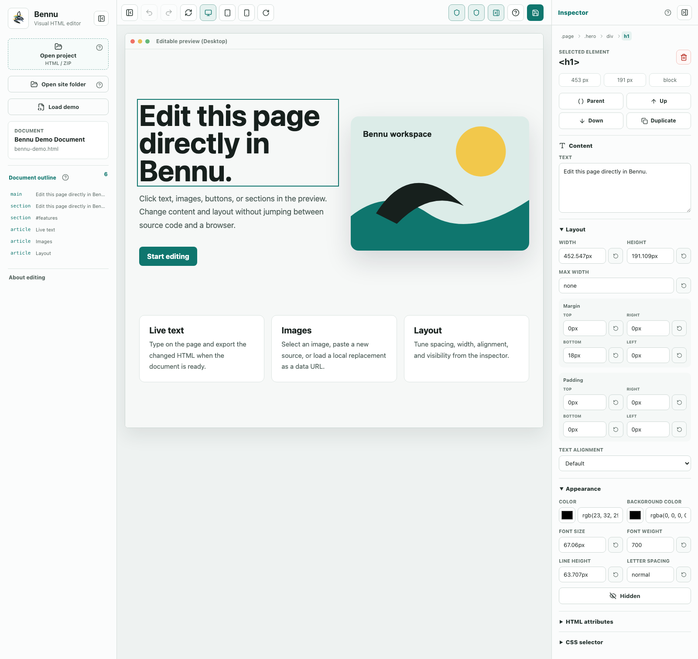

<div align="center">
  

  # Bennu

  **A local-first visual HTML editor that runs entirely in your browser.**

  Open an HTML file, ZIP package, or site folder. Edit the rendered page directly,
  tune elements in the inspector, and export standard HTML or ZIP files.

  [Open Bennu](https://bennu.zakharov.asia/) · [Report a bug](https://github.com/globa-me/bennu/issues/new?template=bug_report.yml) · [Request a feature](https://github.com/globa-me/bennu/issues/new?template=feature_request.yml)

  [](https://bennu.zakharov.asia/)
  [](https://github.com/globa-me/bennu/actions/workflows/ci.yml)
  [](LICENSE)
  [](https://react.dev/)
  [](https://vite.dev/)

  **Support independent GZ Apps development**

  Get ready-to-run builds, updates, and member posts while helping me improve this project.

  [](https://www.patreon.com/c/globa_me)
  [](https://boosty.to/globa_me)
</div>



## Why Bennu

Bennu is for people who need to update an existing HTML page or small static site without switching constantly between source code and a browser. There is no account, project backend, or proprietary output format: projects stay on the device, and export produces files that work without Bennu.

## Highlights

- Open `.html` / `.htm` files, ZIP packages, or complete site folders.
- Edit text directly in a sandboxed live preview.
- Select elements and adjust content, links, images, spacing, dimensions, typography, colors, classes, and visibility.
- Navigate a document outline and selected-element breadcrumbs.
- Move, duplicate, hide, or remove elements with undo and redo.
- Preview desktop, tablet, mobile, rotated, or custom viewport widths.
- Switch the complete interface and onboarding between English and Russian.
- Recover the latest local project from IndexedDB after a reload.
- Export formatted HTML or a complete ZIP package with updated local assets.
- Work offline after the application shell has loaded once.

## Local-first by design

Bennu has no project upload API, account system, analytics, or server-side project storage. Files and edits are processed in the browser. Browser storage helps recover unfinished work; an exported HTML or ZIP file remains the durable copy you own.

Every session starts with two separate safety boundaries:

- **Private Preview** blocks external resources, CSS imports, forms, redirects, embedded documents, and network connections while preserving original values for export.
- **Safe Script Mode** disables project scripts and inline event handlers in the preview and restores them during export.

The editable iframe uses an opaque origin, a minimal `allow-scripts` sandbox, a per-preview session token, and host-side `contentWindow` checks. ZIP imports are limited to 2,000 files, 25 MiB per file, and 200 MiB total uncompressed content.

## Quick start

Requirements: Node.js 20.19+, 22.13+, or 24+.

```bash
git clone https://github.com/globa-me/bennu.git
cd bennu
npm ci
npm run dev
```

Open [http://localhost:5173](http://localhost:5173).

## Commands

| Command | Purpose |
| --- | --- |
| `npm run dev` | Start the local Vite development server |
| `npm test` | Run unit and component tests with Vitest |
| `npm run test:e2e` | Run Playwright browser tests |
| `npm run build` | Create the production build in `dist/` |
| `npm run preview` | Preview the production build locally |
| `npm run deploy` | Build and upload to the configured Cloudflare Pages project |

## How it works

Bennu treats the edited browser DOM as the source of truth. Imported package resources are mapped to local `blob:` URLs for the preview, then restored to relative paths during export. This makes the editor predictable and keeps it independent of a backend, but original whitespace, formatting, and attribute ordering may change.

The application is a static React/Vite site. Core responsibilities are separated into hooks for history, export, package loading, and iframe communication, with package/path handling in `src/lib` and the editor runtime injected into the preview document.

For deeper product decisions and constraints, see [PRODUCT.md](PRODUCT.md).

## Contributing

Bug reports, feature ideas, and focused pull requests are welcome. Please read [CONTRIBUTING.md](CONTRIBUTING.md) before opening a pull request.

## Deployment

The public app runs on Cloudflare Pages at [bennu.zakharov.asia](https://bennu.zakharov.asia/), with [bennu.pages.dev](https://bennu.pages.dev/) as the fallback address. The repository does not require a backend for editing, package loading, preview rendering, or exporting.

## License

Copyright © 2026 [Gennady Zakharov](https://zakharov.asia/). Released under the [ISC License](LICENSE).
